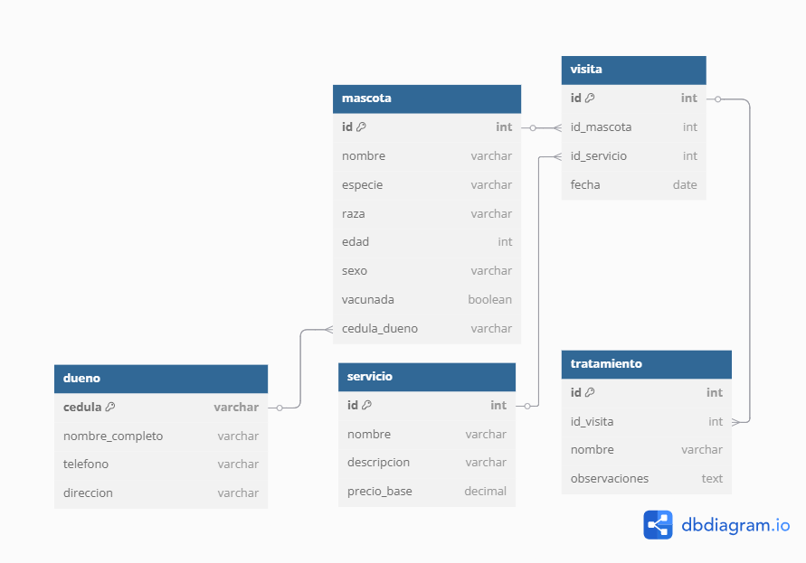

# 🐾 Veterinaria Mi Mejor Amigo

Este proyecto consiste en el diseño e implementación de una base de datos relacional para la veterinaria **"Mi Mejor Amigo"**, con el fin de mejorar el registro de operaciones diarias como atención a mascotas, tratamientos, visitas y servicios prestados.

---

## 📁 Estructura del Repositorio

📦veterinaria-mi-mejor-amigo/
├── estructura.sql       # Script de creación de las tablas (DDL)
├── datos.sql            # Inserción de datos de prueba (DML)
├── consultas.sql        # Consultas SQL demostrativas (DQL)
├── modelo_ER.png        # Imagen del diagrama E-R
└── README.md            # Este archivo

---

## 🔧 Tecnologías Usadas

- **MySQL**
- **MySQL Workbench**
- **Draw.io** para el modelo E-R
- **Visual Studio Code** para edición de scripts

---

## 📌 Entregables

### 1. Diagrama E-R

El modelo incluye las siguientes entidades:

- **Dueño**
- **Mascota**
- **Servicio**
- **Visita**
- **Tratamiento**

Cada entidad contiene su respectiva clave primaria, y se han definido las relaciones con claves foráneas y cardinalidades adecuadas.

> 📎 

---

### 2. Estructura de la Base de Datos (`estructura.sql`)

Contiene todas las instrucciones `CREATE TABLE` con:

- Llaves primarias y foráneas
- Restricciones como `NOT NULL`, `CHECK`, `DEFAULT`, etc.
- Tipos de datos correctos para cada campo

---

### 3. Carga de Datos (`datos.sql`)

Se insertan datos de prueba para:

- 5 Dueños
- 10 Mascotas
- 5 Servicios
- 10 Visitas
- 5 Tratamientos

Esto permite probar el funcionamiento completo de la base de datos.

---

### 4. Consultas SQL (`consultas.sql`)

Incluye **más de 15 consultas** con diferentes niveles de complejidad, utilizando:

- Alias en campos y subconsultas
- Funciones agregadas como `COUNT`, `AVG`, `MAX`
- Funciones de texto (`CONCAT`, `UPPER`, `LOWER`, `LENGTH`, `SUBSTRING`, `TRIM`)
- `ROUND`
- Condiciones `IF`
- `JOIN`, `GROUP BY`, `ORDER BY`
- Creación de tablas a partir de consultas

---

## 🎥 Explicación en Video

📺 La explicación de las consultas y el funcionamiento del sistema en este video:  
👉 [Ver en YouTube](https://www.youtube.com/)

---

## 📬 Contacto

Desarrollado por **Víctor Alejandro Pabon Villamizar**  
📧 [vpabon27.a@gmail.com]  
📍 Bucaramanga, Colombia

---

